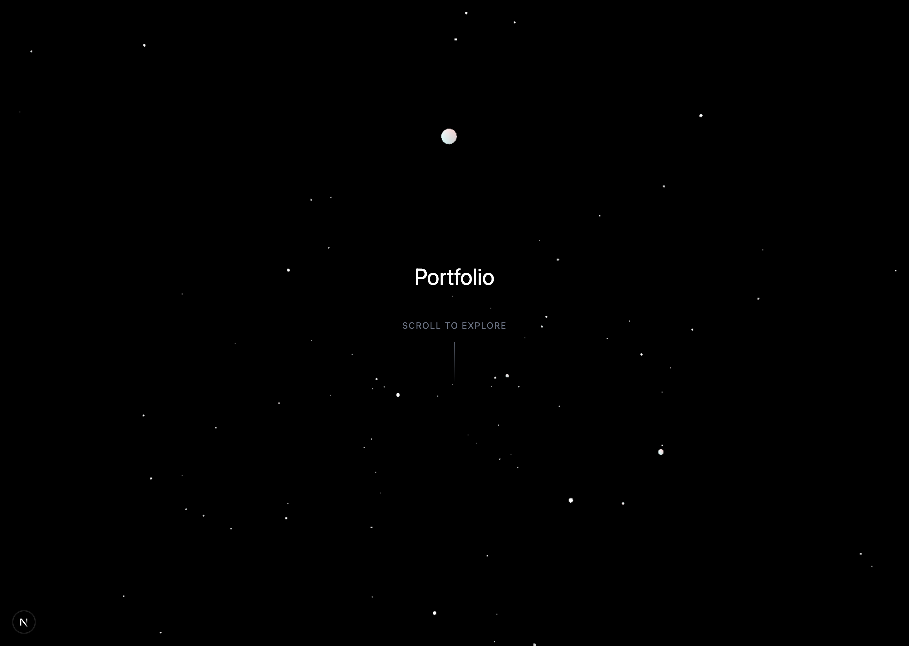
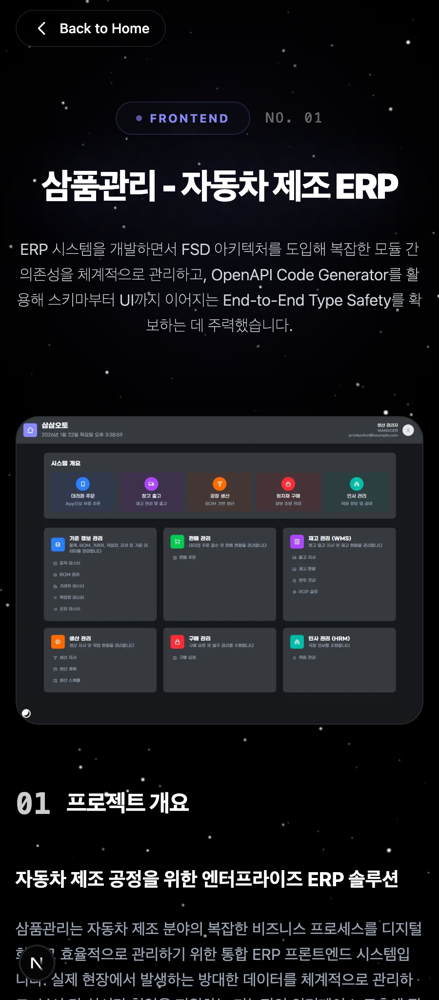

# 프론트엔드 포트폴리오 (Frontend Developer Portfolio)

<br/>

## 프로젝트 개요

웹 프론트엔드 개발자로서 그동안 진행했던 프로젝트와 기술적 역량을 보여주기 위해 틈틈이 개발하고 있는 개인 포트폴리오 웹사이트입니다.
단순히 이력을 나열하는 것에 그치지 않고, 방문해주신 분들에게 시각적인 재미와 부드러운 사용자 경험(UX)을 제공하는 것을 목표로 3D 요소와 인터랙티브 애니메이션에 공을 들여 만들었습니다.

## 구현 및 주요 특징

<details open>
<summary><b>1. 인터랙티브 UX 및 3D 시각 효과 (Interactive UX & 3D Visuals)</b></summary>
<br/>
<p align="center">
  
</p>
<ul>
  <li>GSAP, Framer Motion, 그리고 OGL(WebGL)을 활용해 일반적인 웹에서 보기 힘든 부드러운 스크롤 애니메이션과 3D 시각 효과를 적용하여 사용자 참여도를 높이고자 했습니다.</li>
</ul>
</details>

<details open>
<summary><b>2. 유연한 반응형 레이아웃 및 다크 모드 (Responsive Layout & Dark Mode)</b></summary>
<br/>
<p align="center">
  
</p>
<ul>
  <li>Tailwind CSS를 사용하여 모바일, 태블릿, 데스크탑 등 다양한 해상도에 우아하게 대응하는 반응형 레이아웃을 구성했습니다.</li>
  <li>사용자의 시스템 설정에 맞추거나 직접 토글할 수 있는 다크/라이트 모드를 지원하여 일관적인 디자인 스펙을 제공합니다.</li>
</ul>
</details>

<br/>

- **컴포넌트 중심 설계**: UI 요소들을 잘게 썰어 재사용성을 높였으며, Radix UI를 채택해 스타일링에 구애받지 않고 접근성까지 챙기고자 노력했습니다.
- **Next.js App Router 도입과 성능**: 초기 로딩 속도(FCP) 향상과 SEO 최적화를 고민하며 Next.js 최신 16 버전의 App Router 및 SSR을 활용해 렌더링을 최적화했습니다.

---

## 기술 스택

### 핵심 프레임워크 및 라이브러리

- **Next.js (v16)**: App Router 기반 라우팅 및 SSR 최적화
- **React (v19)**: 성능이 개선된 최신 React 생태계 활용
- **TypeScript (v5.9)**: 정적 타입을 통한 런타임 에러 방지 및 유지보수성 향상

### 스타일링 및 애니메이션

- **Tailwind CSS (v4.1)**: 유틸리티 클래스 기반의 빠르고 일관된 반응형 스타일링 구축
- **Framer Motion (v12) / GSAP (v3.14)**: 선언적 애니메이션 및 세밀하고 복잡한 스크롤 타임라인 제어
- **OGL (v1)**: Three.js보다 가벼운 WebGL 라이브러리로 3D 오브젝트 서빙
- **Radix UI**: WAI-ARIA 규격을 준수하는 UI 기본 골격 구성을 위해 사용

### 환경 및 도구

- **Package Manager**: pnpm을 사용하여 빠르고 효율적인 의존성 관리
- **Lint & Format**: ESLint와 Prettier를 통한 코드 품질 및 컨벤션 유지

---

## 디렉토리 구조

```text
/
├── app/              # Next.js App Router 진입점 및 전역 공통 레이아웃
├── components/       # 재사용 가능한 UI 컴포넌트 모음 (버튼, 네비게이션, 카드 등)
├── content/          # 마크다운 기반의 이력 및 프로젝트 데이터 관리
├── lib/              # 프로젝트 전반에서 사용되는 유틸리티 함수 로직 모음
├── styles/           # Tailwind 전역 CSS 및 공통 폰트/스타일 설정
├── public/           # 로고, 이미지, 아이콘 등 정적 에셋 서빙 폴더
└── __tests__/        # 단위 테스트 스크립트 작성 (Jest 환경)
```

---

## 로컬 실행 가이드

로컬 환경에서 제 포트폴리오를 실행하고 둘러보실 수 있는 안내입니다.

### 1. 사전 준비

- `Node.js` (v18 이상 권장)
- `pnpm` (`npm install -g pnpm`)

### 2. 프로젝트 클론하기

```bash
git clone https://github.com/CHOOSLA/Portfolio.git
cd Portfolio
```

### 3. 패키지 설치

```bash
pnpm install
```

### 4. 개발 서버 시작

```bash
pnpm dev
```

터미널에서 명령어를 실행한 뒤 브라우저에서 `http://localhost:3000`으로 접속하여 확인하실 수 있습니다.

---

## 라이선스

이 프로젝트는 [MIT 라이선스](LICENSE)에 따라 배포됩니다.
